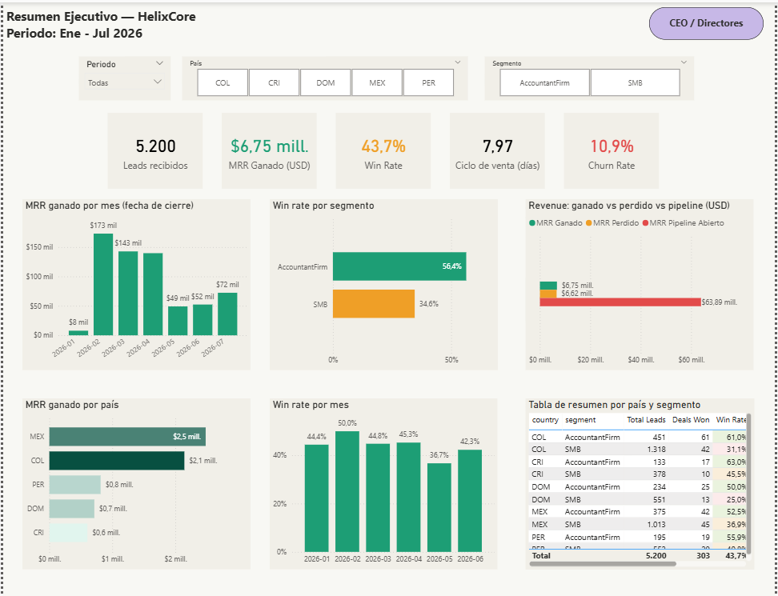
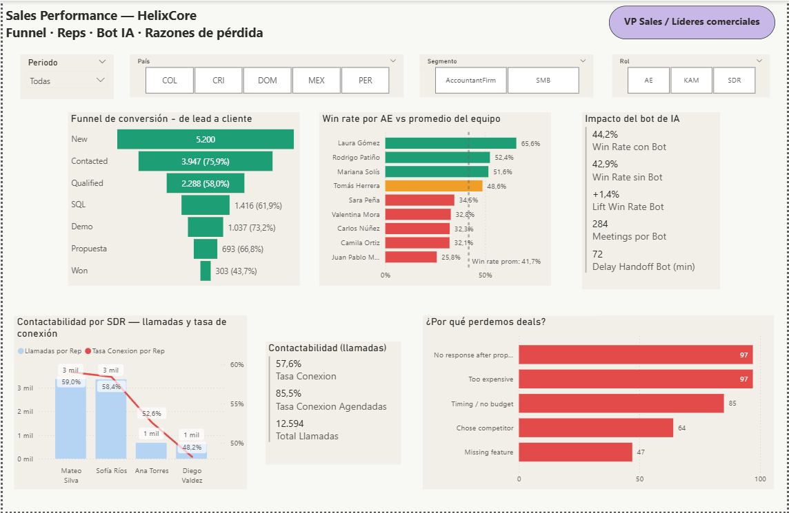
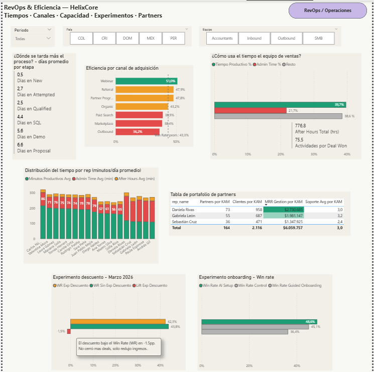

# HelixCore — Commercial Intelligence Dashboard

> **Technical Challenge · Business Intelligence Analyst**
> Built by [Fredys Caballero](https://www.linkedin.com/in/fcaballerosoto/) · BI Analyst


---

## TL;DR

A full-stack BI solution built in **2 calendar days** for a simulated SaaS B2B company (HelixCore) operating in Latin America. The challenge: build an analytical tool that helps Sales, RevOps, and Executive leadership make faster, better decisions — with imperfect data and a hard deadline.

**Result:** 3 Power BI reports · 150 DAX measures · 13 measure categories · 15 actionable insights · Built using Claude AI + Power BI MCP Server as the primary modeling workflow.

> *"We care much more about how you think than how much you build."* — Challenge brief

---

## 📊 Dashboard Screenshots

### Executive Summary — CEO / Directors


### Sales Performance — VP Sales


### RevOps & Efficiency — Operations


---

## 🎥 Video Walkthrough

> [▶ Watch the full presentation (5 min)](https://drive.google.com/file/d/1VIIK4bPf7t-mRZOfRQjf4Y-lOpx56QE-/view?usp=drive_link)
> Dashboard walkthrough + AI workflow demonstration + key findings presented to executive audience.

---

## Business Context

HelixCore is a fast-growing SaaS B2B company in Latin America operating a hybrid commercial model: **self-service**, **sales-assisted**, and **accounting partner channel**. The Sales and RevOps teams were making decisions without visibility — there was a sense that opportunities were being missed, but no one knew exactly where or why.

The challenge simulates a real scenario: imperfect data, limited time (2 days), and the need to decide with what you have.

---

## What I Built

### 3 Reports — One Narrative

The 3 reports follow a descending narrative designed around decision-making, not data display:

```
Report 1 (Executive)  →  How is the business performing?
        ↓
Report 2 (Sales)      →  Where are the commercial problems?
        ↓
Report 3 (RevOps)     →  How do we operate and optimize?
```

Each report has a defined audience, adapted language, and metrics specific to that audience's decisions. All reports share synchronized slicers for Period, Country, and Segment.

| Report | Audience | Key Questions |
|--------|----------|---------------|
| **Executive Summary** | CEO · Directors | MRR, Win Rate, Churn, Pipeline, Revenue by segment & country |
| **Sales Performance** | VP Sales · Team leads | Funnel conversion, rep performance, AI bot impact, lost deal reasons |
| **RevOps & Efficiency** | RevOps · Operations | Time-per-stage, channel performance, experiment results, partner portfolio |

### Data Model

**Star schema** built from 12 source datasets (CSV), 13 tables in Power BI, 22 relationships (10 active, 12 inactive activated via `USERELATIONSHIP`).

| Table | Type | Rows |
|-------|------|------|
| `leads` | Central dimension | 5,200 |
| `reps` | Dimension | 18 |
| `Calendario` | Date Table | 243 |
| `deals` | Fact | 693 |
| `funnel_stage_history` | Fact | 26,436 |
| `sales_activities` | Fact | 30,160 |
| `call_logs` | Fact | 12,594 |
| `bot_interactions` | Bridge | 3,145 |
| `product_signals` | Bridge | 5,200 |
| `subscriptions` | Fact | 303 |
| `partner_portfolios` | Fact | 164 |
| `rep_daily_capacity` | Fact | 2,322 |

**150 DAX measures** organized across 13 thematic folders: Funnel · Revenue · Contactability · Bot AI · Retention · Rep Performance · Product Signals · Partners KAM · Time Intelligence · Trends · Executive · Sales Performance · RevOps Efficiency.

---

## 🔍 Key Insights

### For the CEO
| Insight | Data | Recommended Action |
|---------|------|--------------------|
| Only 10.6% of pipeline is captured | $6.75M won out of $63.9M available | Evaluate team capacity to absorb more volume |
| Accounting firms are the real engine | 27% of leads → 76.6% of MRR, WR 56.4% | Double investment in Partner Program and KAMs |
| Colombia SMB has critical churn | 19% churn vs 10.9% average | Investigate root causes: pricing, product, or expectations? |

### For VP Sales
| Insight | Data | Recommended Action |
|---------|------|--------------------|
| Bottleneck at Contacted → Qualified | Only 58% of contacted leads qualify | Review qualification criteria and ICP definition |
| 97 deals lost to "no response" | 25% of all lost deals | Implement automated follow-up sequence post-proposal |
| Scheduled calls are 28pp more effective | 85.5% vs 57.6% cold | Standardize pre-scheduled calls as mandatory process |
| Juan Pablo Mejía: 18pp below average | WR 25.8% vs 43.7% average | Focused coaching and pipeline review |

### For RevOps
| Insight | Data | Recommended Action |
|---------|------|--------------------|
| Proposal stage "cools" over 6.6 days | Slowest stage in the funnel | SLA of 3 days for post-proposal closing |
| Only 39.7% of time is actual selling | 21.7% is pure admin | Automate admin tasks = +4 rep capacity equivalent |
| Daniela Rivas manages 45% of partner MRR | $2.73M of $6.06M total | Gradual portfolio redistribution plan |
| March discounts didn't close more deals | WR dropped -1.5pp with discount | Remove discount as a closing tactic |
| AI Setup Assistant is the best onboarding | 48.6% WR vs 45.1% Control | Full rollout as standard onboarding experience |

---

## ⚙️ How It Was Built — Claude AI + MCP Server

This project was built using an **AI-first workflow**: Claude AI connected directly to Power BI Desktop via the Power BI MCP Server, enabling natural language data modeling without manually editing the Power BI interface.

### Workflow

```
Step 0  →  6-layer context prompt (role, context, goal, constraints, format, criteria)
Step 1  →  Connect Claude to the active .pbix file
Step 2  →  Full model diagnosis (data types, cardinality, quality issues)
Step 2.1 → Power Query transformations (UTF-8 encoding, decimal types, calculated columns)
Step 2.2 → RutaOrigen parameter for environment switching
Step 2.3 → Calendar table in M language (243 days, Colombia holidays, 15 columns)
Step 2.4 → Delete 28 incorrectly auto-detected relationships
Step 2.5 → Create 22 clean star schema relationships
Step 3  →  150 DAX measures across 13 thematic folders
Step 4  →  Full model validation (referential integrity, types, KPIs)
Step 5  →  3 report mockups with live model data
Step 6  →  Insight extraction via DAX queries from Claude
Step 7  →  Documentation + presentation
```

### The 6-Layer Prompt

The session started with a structured prompt that defined the full context before any action was taken:

```
1. ROLE: Senior BI Analyst with 25 years experience in Sales/RevOps,
   AI and Power BI MCP expertise, SaaS B2B/SMB companies.

2. CONTEXT: Technical challenge for Alegra. Simulated company: HelixCore.
   Hybrid model: self-service, sales-assisted, accounting partners.

3. GOAL: Power BI dashboard (3 reports: Executive, Sales, RevOps)
   + Presentation + README. AI First approach.

4. CONSTRAINTS: 2 days. Prioritize what matters.
   Deadline: April 23, 2026.

5. FORMAT: Power BI with MCP Server. Storytelling with Data principles.

6. CRITERIA: Clarity, utility, actionability.
   Think like a business, not a technician.
```

### Key Problems Solved

| Problem | Solution |
|---------|----------|
| Encoding 1252 → truncated names (Gómez, Patiño) | Changed to Encoding=65001 (UTF-8) on all tables |
| 28 incorrectly auto-detected relationships | Deleted all, rebuilt 22 clean star schema relationships |
| 1:1 relationships with OneDirection causing errors | Changed to BothDirections on bridge tables |
| Calendar ambiguity via multiple paths | Single active relationship (leads→Calendar), others inactive via USERELATIONSHIP |
| Int64 types on MRR fields (decimals truncated) | Forced Double type via column_operations update |

---

## 🛠️ Tech Stack

| Tool | Role |
|------|------|
| **Power BI Desktop** | Dashboard, data modeling, visualizations |
| **Claude AI (Sonnet 4.6)** | Senior BI co-pilot — DAX, modeling, insights, design |
| **Power BI MCP Server** | Protocol connecting Claude → Power BI (modeling via natural language) |
| **Power Query (M)** | Transformations, cleaning, Calendar table, environment parameters |
| **DAX** | 150 measures in 13 thematic folders |
| **Google Drive** | Source dataset storage |

---

## 📁 Repository Structure

```
helix-core-bi-challenge/
├── dashboard/
│   └── RetoTecnicoAlegra.pbix       ← Main Power BI file
├── datasets/
│   ├── leads.csv
│   ├── deals.csv
│   ├── funnel_stage_history.csv
│   ├── sales_activities.csv
│   ├── call_logs.csv
│   ├── bot_interactions.csv
│   ├── product_signals.csv
│   ├── subscriptions.csv
│   ├── partner_portfolios.csv
│   ├── reps.csv
│   ├── rep_daily_capacity.csv
│   └── data_dictionary.csv
├── docs/
│   └── screenshots/
│       ├── 01_resumen_ejecutivo.png
│       ├── 02_sales_performance.png
│       └── 03_revops_eficiencia.png
├── README.md                         ← This file (English — portfolio version)
└── video.md                          ← Video presentation link
```

---

## 🚀 How to Use

**Prerequisites:** Power BI Desktop (March 2026 or later)

1. Clone or download this repository
2. Open `dashboard/RetoTecnicoAlegra.pbix` in Power BI Desktop
3. Go to `Home → Transform Data → Power Query Editor`
4. Find the **`RutaOrigen`** parameter and update it to your local `datasets/` folder path
   - Example: `C:\Projects\helix-core-bi-challenge\datasets`
5. Close the editor and click **Apply Changes**
6. All 3 report tabs will load with your local data

---

## What I'd Do Next

With the model and 150 measures in place, the next iteration would focus on analytical depth:

- **Cohort retention analysis** — month-over-month retention curves by acquisition channel
- **Best call-time analysis** — which hours have the highest connection rates per SDR
- **Lead profile analysis** — which buyer_role + company_size combinations have the highest win rate
- **RLS (Row-Level Security)** — each rep sees only their own data
- **Live data connection** — replace CSVs with Snowflake or Salesforce integration
- **Mobile-optimized report** — key KPIs for executive consumption on mobile

---

## About

**Fredys Caballero** — Business Intelligence Analyst

4+ years building BI infrastructure, executive dashboards, and analytical models across high-growth tech companies. Specialized in Power BI, SQL, Python, and data democratization.

[](https://www.linkedin.com/in/fcaballerosoto/)
[](mailto:fredyscaballero@gmail.com)
[](https://github.com/fcaballerodata)

---

*Built with Claude AI (Sonnet 4.6) + Power BI MCP Server · April 2026*